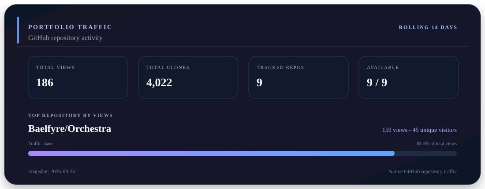

---

  

  
  
  
  
  

---

### 👨‍💻 About Me

I am a BSIT Data Analytics student and legal operations professional who builds systems around one recurring problem: **how do you make complex work easier to understand, verify, and maintain?**

Operations taught me where workflows break. Software lets me structure them. Data lets me measure them. Governance defines what automation is allowed to do. Research tests whether the assumptions behind the system actually hold. That is the thread connecting the projects below.

  <strong>🎓 Studying</strong> 
  BSIT, Data Analytics @ Mapúa Malayan Digital College · 2024 - 2028

  <strong>💼 Working</strong> 
  Impact Assistant · Legal operations, CRM workflows, compliance tracking, e-filing, and document processing

  <strong>🎯 Focus Areas</strong> 
  Software architecture · data-driven applications · AI workflow orchestration · development analytics · cybersecurity · operational automation

---

### 🧩 Current Focus

I am building toward a stack that connects software engineering, data persistence, operations automation, AI-assisted development, and measurable development evidence.

<table>
<tr>
<td width="50%" valign="top">
<strong>AI-Assisted Software Development</strong> 
Specialist orchestration, MCP integration, bounded adaptive behavior, validation evidence, and human approval boundaries
</td>
<td width="50%" valign="top">
<strong>Data-Driven Systems</strong> 
SQL, relational modeling, persistence architecture, schema tooling, analytics, and deterministic validation
</td>
</tr>
<tr>
<td width="50%" valign="top">
<strong>Multi-Tenant Platforms</strong> 
Tenant isolation, identity, RBAC, storefront and service workflows, and SaaS architecture
</td>
<td width="50%" valign="top">
<strong>Development Analytics</strong> 
Telemetry, validation outcomes, rework, failure modes, comparative testing, and evidence-backed decisions
</td>
</tr>
<tr>
<td width="50%" valign="top">
<strong>Security &amp; Governance</strong> 
Least privilege, explicit authority, traceability, source-backed compliance intelligence, security gates, and fail-closed workflow design
</td>
<td width="50%" valign="top">
<strong>Operational Automation</strong> 
Reducing manual tracking, improving process consistency, and supporting real-world workflows
</td>
</tr>
</table>

---

### 🚀 Featured Projects

These projects tackle different parts of the same systems problem: operations, structure, orchestration, compliance intelligence, assessment, research quality, and local AI collaboration.

<!-- FEATURED_PROJECTS:START -->
<table>
<tr>
  <td width="50%" valign="top">
    <strong>Orderly</strong> 
    Brings storefronts, service delivery, orders, appointments, staff, customer feedback, and operational insight into one governed platform built for Philippine MSMEs.
  </td>
  <td width="50%" valign="top">
    <strong>CritiQual</strong> 
    Turns technical research artifacts into evidence-grounded quality, gap, challenge-surface, and defense-preparation signals while keeping authorship and academic judgment human.
  </td>
</tr>
<tr>
  <td width="50%" valign="top">
    <strong>SchemaForge</strong> 
    Makes database structure inspectable and transformable locally through deterministic schema analysis, conversion, business logic, and security checks, with AI kept advisory.
  </td>
  <td width="50%" valign="top">
    <strong><a href="https://github.com/Baelfyre/Orchestra">Orchestra</a></strong> 
    Coordinates AI-assisted development as a governed system of specialist routing, validation, evidence, and human approval rather than an unbounded agent loop.
  </td>
</tr>
<tr>
  <td width="50%" valign="top">
    <strong><a href="https://github.com/Baelfyre/Orchestra-Compliance-Registry">Orchestra Compliance Registry</a></strong> 
    Turns official compliance sources into versioned, machine-readable evidence with provenance, monitoring, and explicit human and legal authority boundaries.
  </td>
  <td width="50%" valign="top">
    <strong>HiveMind Pathway</strong> 
    Measures technical capability through deterministic adaptive assessment, controlled scoring, and governed progression toward trustworthy results.
  </td>
</tr>
<tr>
  <td width="50%" valign="top">
    <strong><a href="https://github.com/Baelfyre/hivemind-showcase">HiveMind Workspace</a></strong> 
    Explores local-first AI collaboration where models, workspace data, and orchestration stay closer to the user instead of depending entirely on remote services.
  </td>
  <td width="50%" valign="top"></td>
</tr>
</table>
<!-- FEATURED_PROJECTS:END -->

<strong>📡 Current Project Status</strong>

 

<!-- PROJECT_STATUS:START -->
| Project | Current State | Next Direction |
| --- | --- | --- |
| Orderly | Core business platform capabilities and contextual communications are verified. | Continue governed maintenance and release-readiness work. |
| CritiQual | CQ15 complete and verified | CQ16 - Pilot Validation and Product Hardening |
| SchemaForge | Backend B1-B8 verified; frontend workbench integration in progress | Complete remaining frontend workflow integration and integrated local bundle |
| [Orchestra](https://github.com/Baelfyre/Orchestra) | Latest release: v1.9.0 UIEF | Next release: not announced |
| [Orchestra Compliance Registry](https://github.com/Baelfyre/Orchestra-Compliance-Registry) | Trusted release registry-v0.4.0; R7.1-R7.9 implemented and Orchestra O7.7 joint conformance complete | Expand source-backed coverage across software development, cybersecurity, data governance, AI, accessibility, and provider/platform requirements |
| HiveMind Pathway | Governed split-architecture release-readiness implementation in progress; production deployment remains gated | Complete security, policy, and release-readiness validation before production |
| [HiveMind Workspace](https://github.com/Baelfyre/hivemind-showcase) | Repository split and bounded runtime-integration planning are in progress; broader implementation remains deferred | Complete current planning and reassess implementation priority after the Orderly capstone |
<!-- PROJECT_STATUS:END -->

<strong>ℹ️ How portfolio status is generated</strong>

Featured Projects explains why each system exists. Current Project Status reports where it is now. Both derive from bounded `profile-pio.json` public-presentation contracts. Private trackers, validation logs, branches, prompts, and internal state are not profile data sources.

---

### ☕ Support My Open-Source Work

If any of my open-source projects are useful to you, you can support ongoing development, testing, documentation, and maintenance.

  

---

### 🛠️ Tech Stack & Skills

  <strong>Core Stack</strong> 
  High-signal languages, frameworks, data systems, automation, and version control

  
  
  
  
  
  
  
  
  
  

<strong>&#129520; Full development toolchain</strong>

  <strong>Frontend &amp; Web</strong> 
  Web application development, interface systems, and accessibility foundations

  
  
  
  

  <strong>Backend, Database &amp; Persistence</strong> 
  Application services, relational databases, persistence layers, and schema engineering

  
  
  

  <strong>AI, Automation &amp; Development Tools</strong> 
  AI-assisted development, local AI tooling, version control, automation, and deployment workflow

  
  
  
  
  
  
  
  
  
  

---

### 📊 GitHub Stats

  

  

---

### 🎓 Academic Projects

#### MotorPH System Evolution

<table>
<tr>
<td width="50%" valign="top">
<strong>MO-IT110</strong> 
Object-Oriented Programming

A four-person MotorPH desktop prototype focused on OOP fundamentals, role-aware payroll and employee workflows, validation, audit-friendly CSV-backed persistence, and separation between presentation, use-case, service, repository, and domain responsibilities.

<code>4-person team · Java Swing · CSV-backed persistence · 5-layer application structure</code>

</td>
<td width="50%" valign="top">
<strong>MO-IT113</strong> 
Advanced Object-Oriented Programming

A four-person MotorPH system applying layered OOP architecture to payroll, employee management, authentication, RBAC, attendance, leave, overtime, reporting, persistence, and operational workflows.

<code>JavaFX · Maven · Hibernate/JPA · MySQL · layered OOP architecture</code>

Documented project role: <strong>Database and Backend OOP Logic Analyst</strong>.

</td>
</tr>
</table>

---

### 🔬 Research & Capstone

I maintain a private capstone research repository as a durable record of candidate projects, research directions, methodology, decisions, and supporting evidence.

<table>
<tr>
<td width="50%" valign="top">
<strong>CritiQual</strong> 
Research quality assurance and applied meta-research that combines software engineering, data analytics, research-on-research, deterministic auditing, and later benchmark-validated machine learning to improve how students develop and review technical research.
</td>
<td width="50%" valign="top">
<strong>Data-Driven Governance Framework for AI-Assisted Software Development</strong> 
Studies how AI agents, plugins, curated context, validation gates, handoffs, and human approvals affect development quality, efficiency, rework, reliability, and failure modes.
</td>
</tr>
<tr>
<td width="50%" valign="top">
<strong>Orderly / MSME Business Management Platform</strong> 
Evaluates a mature application-oriented capstone direction with operational, customer, and product-usage analytics potential.
</td>
<td width="50%" valign="top">
<strong>Development Analytics</strong> 
Captures development telemetry so AI-assisted software development can be evaluated with quantitative evidence instead of relying only on qualitative observations.
</td>
</tr>
</table>

> **CritiQual Prime Directive:** help students and researchers produce rigorous, defensible, and useful technical research through standardized, transparent, evidence-grounded auditing and decision support, without replacing student authorship, independent judgment, mentors, professors, reviewers, or institutional academic authority.

For CritiQual, the standardization target is the **review and quality-assurance process**, not a single universal thesis format. Future analytics or machine-learning capabilities must remain measurable, evidence-bounded, and subordinate to qualified human academic judgment.

<strong>Supporting systems and research boundaries</strong>

Supporting systems such as Orchestra, Orchestra Compliance Registry, SchemaForge, Pathway, and HiveMind may provide development evidence, technical references, or experimental environments without automatically becoming the final capstone topic.

---

### 💼 Professional Background

Before focusing more heavily on software development and AI workflow systems, I built a strong foundation in communication, troubleshooting, process control, and operational support across BPO, technical support, and legal operations.

  <strong>Impact Assistant / Legal Operations Support</strong> 
  Legal workflows · document processing · CRM updates · compliance tracking · e-filing · case-related administrative operations

Recognized as an Outstanding Impact Assistant in 2023.

  <strong>Operations Team Lead &amp; Technical Support SME</strong> 
  Team coaching · escalated technical concerns · service quality support · operational workflow improvement

  <strong>Customer Service and Technical Support</strong> 
  Billing · account concerns · internet troubleshooting · service issues · customer-facing problem resolution

These experiences shaped how I approach software: not just as code, but as a way to organize work, reduce friction, improve reliability, and build systems people can actually use.

For my full CV and professional history, please connect with me on [LinkedIn](https://www.linkedin.com/in/ongojames).

<!---
Baelfyre/Baelfyre is a special repository because its README.md appears on the GitHub profile.
Featured Projects and Current Project Status are generated from bounded project PIO contracts.
--->