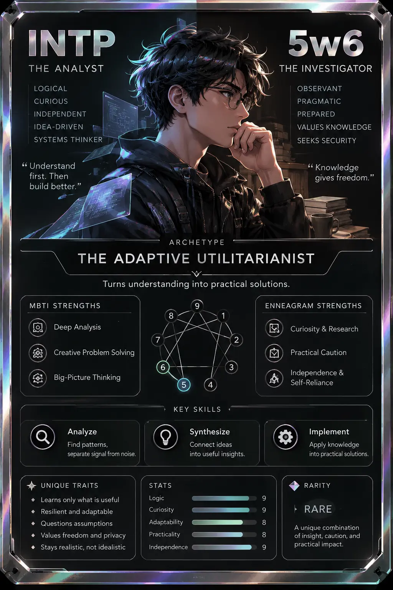
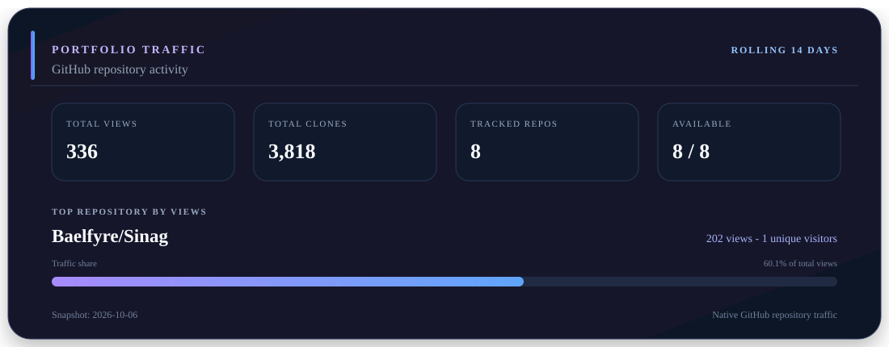

  

I build software, data, and AI-assisted systems around a recurring question: **how can complex work become easier to understand, verify, and maintain?**

BSIT Data Analytics student at Mapúa Malayan Digital College with a professional background in legal operations, workflow automation, and systems architecture. My work focuses on building verifiable software, local-first applications, structured data analysis, and governed AI-assisted workflows.

[LinkedIn](https://www.linkedin.com/in/ongojames) · [Featured Projects](#featured-projects) · [Current Focus](#current-focus) · [About Me](#about-me) · [Tech Stack](#tech-stack) · [GitHub Activity](#github-activity) · [Connect](#connect)

---

## 🚀 Featured Projects

Current systems and experiments across education, software architecture, data, automation, governance, assessment, and research-support work.

<!-- FEATURED_PROJECTS:START -->
<table>
<tr>
  <td width="50%" valign="top">
    <strong><a href="https://sinag-fawn.vercel.app/">Sinag</a></strong> 
    Local-first multilingual learning app for grade-school learners, combining Filipino, English, and Hiligaynon practice with accessible learning flows, parent progress insights, and no feature paywalls.
  </td>
  <td width="50%" valign="top">
    <strong>Orderly</strong> 
    Brings storefronts, service delivery, orders, appointments, staff, customer feedback, and operational insight into one governed platform built for Philippine MSMEs.
  </td>
</tr>
<tr>
  <td width="50%" valign="top">
    <strong>CritiQual</strong> 
    Research-support system for structured technical quality review and evidence-aware analysis. Detailed academic scope and methodology are intentionally kept private while the work remains in progress.
  </td>
  <td width="50%" valign="top">
    <strong>SchemaForge</strong> 
    Makes database structure inspectable and transformable locally through deterministic schema analysis, conversion, business logic, and security checks, with AI kept advisory.
  </td>
</tr>
<tr>
  <td width="50%" valign="top">
    <strong><a href="https://github.com/Baelfyre/Orchestra">Orchestra</a></strong> 
    Coordinates AI-assisted development as a governed system of specialist routing, validation, evidence, and human approval rather than an unbounded agent loop.
  </td>
  <td width="50%" valign="top">
    <strong>TITO PAR</strong> 
    Windows-first, local-first Personal Assistant Runtime built around governed authority, contextual assistance, structured workflows, and a planned Task Intelligence &amp; Tool Orchestrator integration.
  </td>
</tr>
<tr>
  <td colspan="2" valign="top" align="center">
    <strong><a href="https://github.com/Baelfyre/Orchestra-Compliance-Registry">Orchestra Compliance Registry</a></strong> 
    Turns official compliance sources into versioned, machine-readable evidence with provenance, monitoring, and explicit human and legal authority boundaries.
  </td>
</tr>
</table>
<!-- FEATURED_PROJECTS:END -->

<strong>📡 Current Project Status</strong>

 

<!-- PROJECT_STATUS:START -->
| Project | Current State | Next Direction |
| --- | --- | --- |
| [Sinag](https://sinag-fawn.vercel.app/) | Language-learning MVP scope, learner flows, progress analytics, accessibility requirements, and provenance-aware content validation foundations are defined and under active implementation. | Continue frontend integration, canonical content validation, local progress persistence, sound and visual feedback, and progressive 3D study-buddy exploration. |
| Orderly | Core business platform capabilities and contextual communications are verified. | Continue governed maintenance and release-readiness work. |
| CritiQual | CQ16F complete and verified | CQ16G next |
| SchemaForge | Backend B1-B8 verified; frontend workbench integration in progress | Complete remaining frontend workflow integration and integrated local bundle |
| [Orchestra](https://github.com/Baelfyre/Orchestra) | Latest release: v1.9.0 UIEF; v1.10.0 candidate prepared | Next release: v1.10.0 pending final qualification and human publication approval |
| TITO PAR | Baseline repair and release requalification are in progress. R0-R8 are canonically resolved through BR5; BR6 addresses release identity, licensing metadata, and documentation truthfulness. | Complete BR6, then BR7 architecture normalization and release requalification before claiming a completed v1.0 release. |
| [Orchestra Compliance Registry](https://github.com/Baelfyre/Orchestra-Compliance-Registry) | Trusted release registry-v0.4.0; R7.1-R7.9 implemented and Orchestra O7.7 joint conformance complete | Expand source-backed coverage across software development, cybersecurity, data governance, AI, accessibility, and provider/platform requirements |
<!-- PROJECT_STATUS:END -->

<strong>ℹ️ Portfolio status model</strong>

Featured Projects explains why each system exists. Current Project Status reports where it is now. Both are generated from bounded `profile-pio.json` public-presentation contracts. Private trackers, validation logs, branches, prompts, and internal state are not profile data sources.

---

## 🎯 Current Focus

- **Software & Data Systems**: Application architecture, persistence, relational modeling, analytics, validation, and maintainable system boundaries.
- **AI-Assisted Development & Governance**: Specialist orchestration, bounded autonomy, validation evidence, traceability, least privilege, and explicit human approval boundaries.
- **Local-First Tools**: Desktop and browser experiences that keep useful state and core workflows close to the user while remaining portable and inspectable.
- **Educational Technology**: Accessible, age-appropriate learning systems that combine structured content, feedback, progress analytics, and playful interaction without gating learning.

---

## 🧠 About Me & Developer Archetype

My work sits at the intersection of software engineering, analytics, local-first applications, AI-assisted development, governance, and human-centered product design.

### The Adaptive Utilitarianist (INTP × 5w6)
*Analyze → Synthesize → Implement*

A practical systems thinker who learns deeply, tests ideas in reality, and refines by evidence. I am naturally drawn to patterns, useful frameworks, and solutions that make complex work easier to understand, improve, and maintain.

- **Studying**: BSIT, Data Analytics @ Mapúa Malayan Digital College (2024 - 2028)
- **Working**: Impact Assistant (Legal operations, CRM workflows, compliance tracking, e-filing, document processing)
- **Focus Areas**: Software systems, data analytics, AI-assisted development, local-first applications, educational technology, security, and governance

  

---

## 🛠️ Tech Stack & Skills

### 💻 Core Languages & Frameworks

  
  
  
  
  
  
  
  

*Frameworks & GUI:* JavaFX

### 🗄️ Data & Persistence

  
  
  

*Concepts & Architecture:* SQL · Relational Modeling · Local Persistence Architecture · Tableau

### ⚙️ Engineering, Workflow & Tooling

  
  
  
  
  
  
  
  
  
  

*Workflow, Tools & AI:* CI/CD · VS Code · PowerShell · Codex

---

## 🎓 Academic & Research Work

My academic work supports the same broader direction as the portfolio: turning software, data, and research questions into systems that can be inspected, tested, and improved.

<strong>MotorPH System Evolution</strong>

 

| Course | Focus | Stack |
| --- | --- | --- |
| MO-IT110 Object-Oriented Programming | Four-person desktop prototype covering payroll, employee workflows, validation, audit-friendly persistence, and layered responsibilities. | Java Swing · CSV-backed persistence |
| MO-IT113 Advanced Object-Oriented Programming | Layered payroll and employee-management system with authentication, RBAC, attendance, leave, overtime, reporting, and persistence. | JavaFX · Maven · Hibernate/JPA · MySQL |

Documented MO-IT113 project role: **Database and Backend OOP Logic Analyst**.

<strong>Private Academic Research</strong>

 

**CritiQual** supports structured technical quality review and evidence-aware analysis. Public details remain intentionally limited while scope, methodology, evaluation, and academic review are still in progress.

Detailed research questions, datasets, evaluation design, candidate capstone directions, and internal development evidence are intentionally not published here.

---

## 💼 Professional Background

My professional background includes legal operations, technical support, customer service, and team leadership. That experience shapes how I approach software: as a way to reduce friction, improve process reliability, create traceable workflows, and build tools people can actually use.

**⚖️ Impact Assistant / Legal Operations Support** 
Legal workflows, document processing, CRM updates, compliance tracking, e-filing, and case-related administrative operations. Recognized as an Outstanding Impact Assistant in 2023.

**🧭 Operations Team Lead & Technical Support SME** 
Team coaching, escalated technical concerns, service quality support, and operational workflow improvement.

**🎧 Customer Service & Technical Support** 
Billing, account concerns, network troubleshooting, service issues, and customer-facing problem resolution.

For my full CV and professional history, connect with me on [LinkedIn](https://www.linkedin.com/in/ongojames).

---

## 📊 GitHub Activity

  

**Public repository traffic — rolling 14 days**

Traffic counts below are repository views and clones, **not personal profile visits**. Orchestra is the featured repository; if its traffic is unavailable, the card will show a pending state rather than substitute profile-repository numbers.

  

---

## 🤝 Connect & Support

If any of my open-source work has been helpful to you, feel free to connect or consider optional support for continued development, testing, and maintenance.

  
  &nbsp;&nbsp;
  

<!---
Baelfyre/Baelfyre is a special repository because its README.md appears on the GitHub profile.
Featured Projects and Current Project Status are generated from bounded project PIO contracts.
--->
